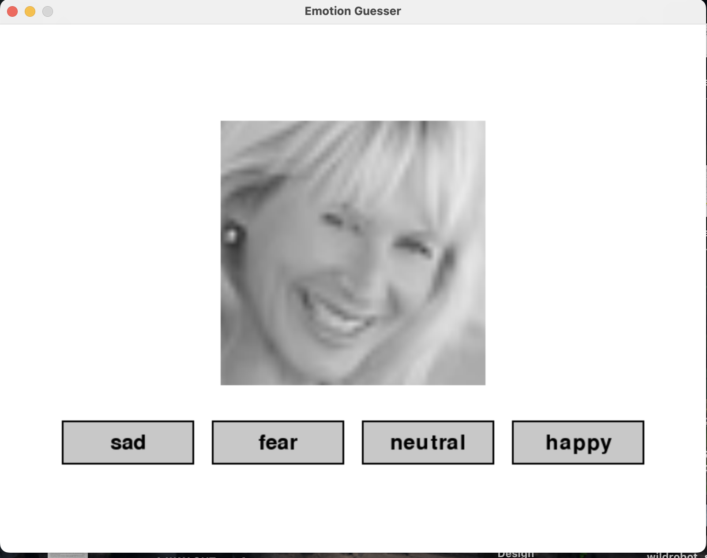

# CS4100: Emotion Guesser

An interactive game that teaches facial emotion recognition using **computer vision** and **adaptive AI planning**.

This project combines a deep learning perception model with an adaptive curriculum layer to create a personalized learning experience based on user performance.

<!-- Project Overview -->
## Project Overview

### 1. Perception Layer
We use a **ResNet-18** model trained on the FER+ dataset to classify facial expressions.

- Evaluated different models:
  - CNN  
  - Vision Transformer (ViT)  
  - ResNet  
- **ResNet performed best** with ~82.28% accuracy  
- Final model predicts 7 emotions:  
  `['angry', 'disgust', 'fear', 'happy', 'neutral', 'sad', 'surprise']`

#### Image Processing
For each input image:
- Convert grayscale → 3 channels  
- Resize to **224 × 224**  
- Apply ImageNet normalization  
- Pass through ResNet-18  

#### Model Outputs
- A probability distribution over emotions using Softmax  
- The highest-probability emotion is selected as the prediction  
- The probability is used as a **confidence score**

--

### 2. Planning Layer
The game includes an `AdaptivePlanner` that personalizes gameplay using a **utility-based approach**.

It tracks:
- Accuracy  
- Response time  
- Error streaks  
- Confusion between emotions  

Based on these metrics, the system:
- Repeats difficult emotions  
- Adjusts difficulty  
- Balances learning and frustration  

<!-- How to Play -->
## How to Play
- A face image is displayed on screen  
- Four emotion options are shown as buttons  
- Click the option you think best matches the emotion  
- Performance is tracked across rounds  
- A stats summary is shown after every 10 rounds

<p align="center">
  
</p>

<!-- Motivation -->
## Motivation
This project was inspired by challenges in teaching emotion recognition for neurodivergent individuals, particularly those with autism spectrum disorder (ASD). Traditional tools like flashcard lack adaptability based on the user. This system aims to use real human faces, provide adaptive learning, and create a more personalized experience.

This system aims to:
- Use real human faces  
- Provide adaptive learning  
- Create a more personalized experience  

The goal is not to diagnose individuals, but to serve as a learning tool for improving emotional and social understanding.

<!-- How to Run -->
## How to Run

Install dependencies:
```sh
pip install pygame
```

Run the game:
```sh
python game.py
```

Or run from root directory:
```sh
python -m src.planning.game
```
